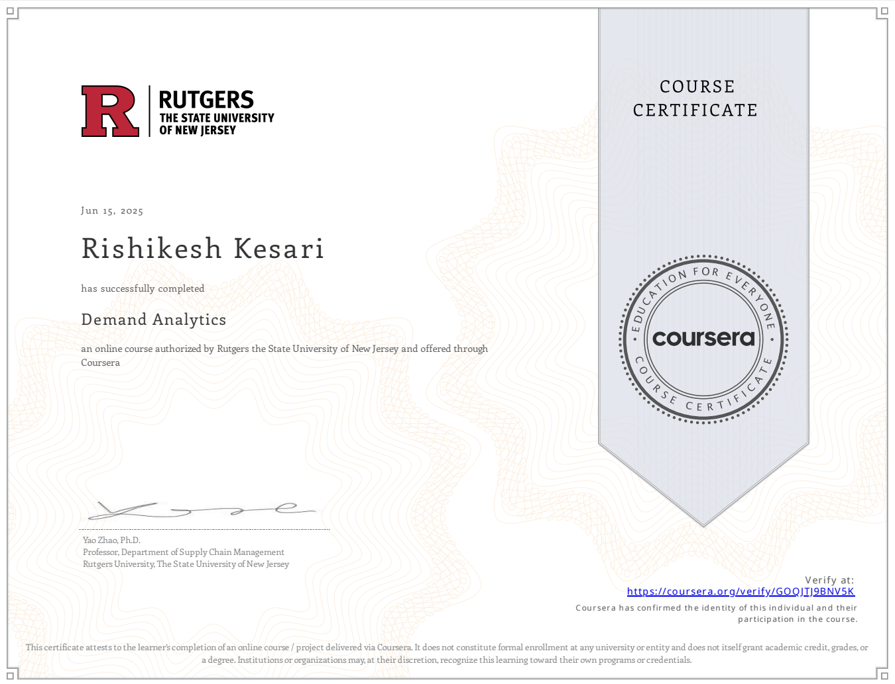

# Demand Analytics Foundations  
Rutgers University

## Overview

This course focuses on applied demand analytics for forecasting and planning using real-world business data.

It covers methods to improve demand prediction accuracy, identify key demand drivers, and translate statistical outputs into actionable business insights.

The emphasis is on connecting data modeling with demand planning and decision support.

---

## Core Focus

- Demand forecasting using real-world datasets  
- Identification and quantification of demand drivers  
- Model development and validation for improved accuracy  
- Application of analytics to demand planning and decision-making  

---

## Key Analytical Areas

### Demand Drivers
- Trend and seasonality  
- Pricing effects  
- External and environmental factors  

### Forecasting Methods
- Regression analysis  
- Time series forecasting  
- Feature engineering for predictive modeling  

### Data Preparation
- Continuous and categorical variable handling  
- Feature construction for model improvement  

### Demand Influence
- Understanding how demand responds to pricing and market conditions  
- Using analytics to support demand shaping and planning decisions  

---

## Key Insight

Demand analytics links statistical modeling with business decision-making by quantifying what drives demand and improving forecasting accuracy for planning and strategy.

---

## Key Takeaway

Accurate demand forecasting is a continuous process of identifying drivers, modeling relationships, and refining predictions to support better operational and strategic decisions.
